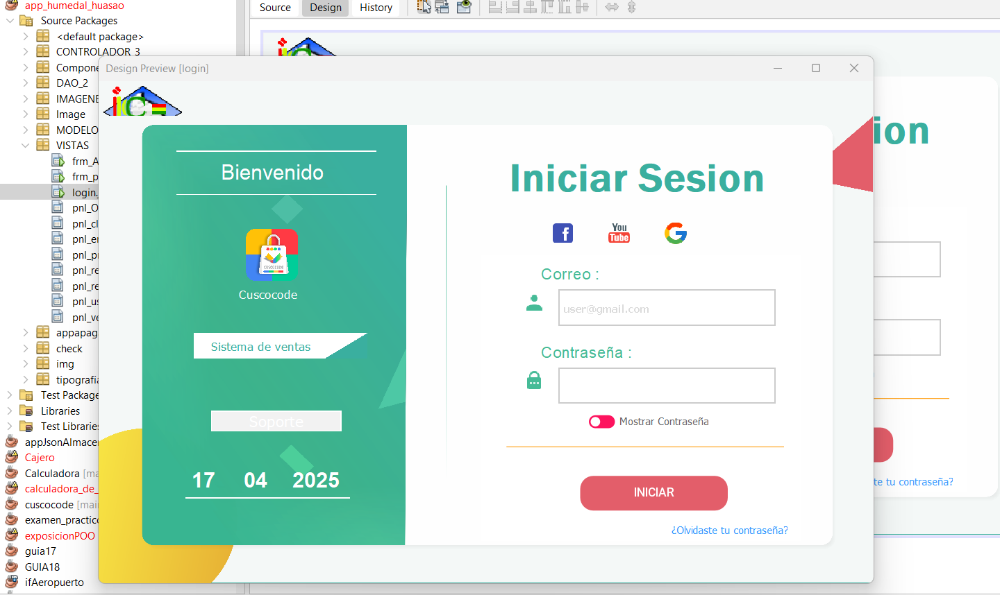
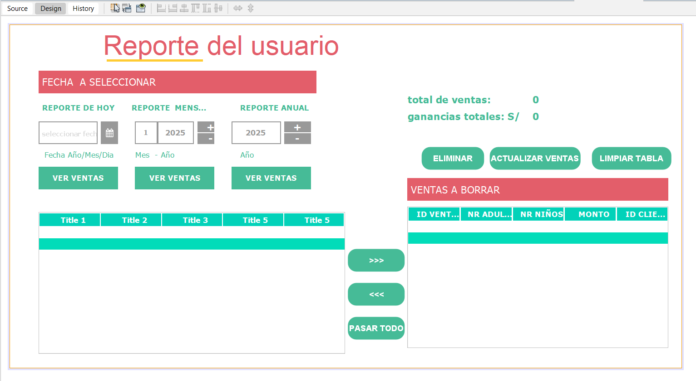
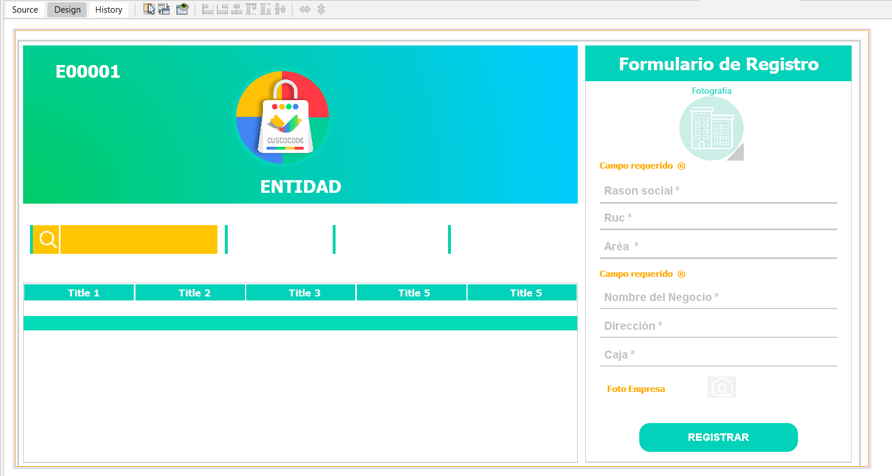
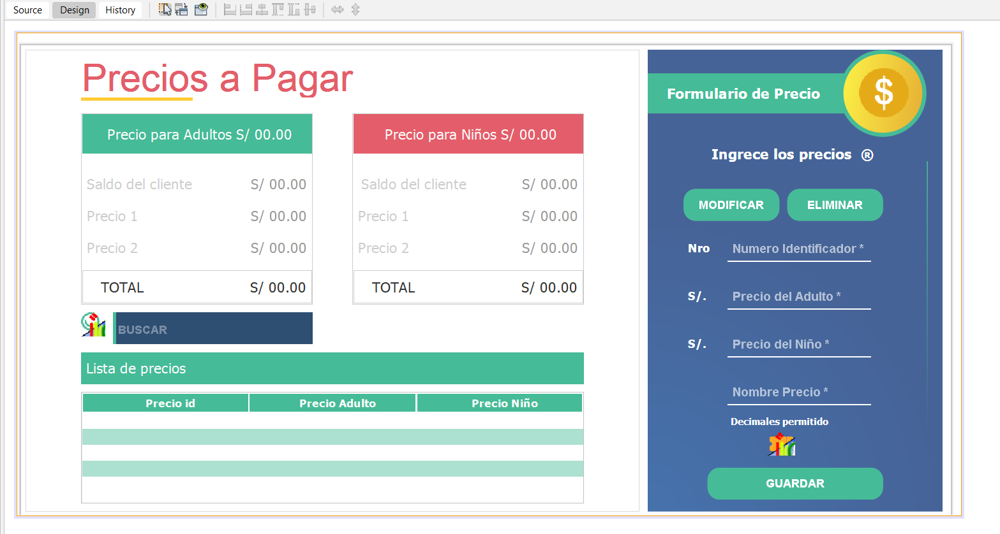
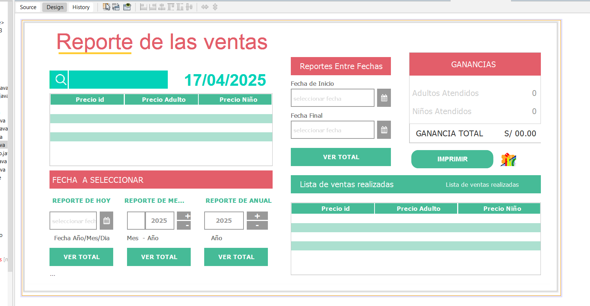
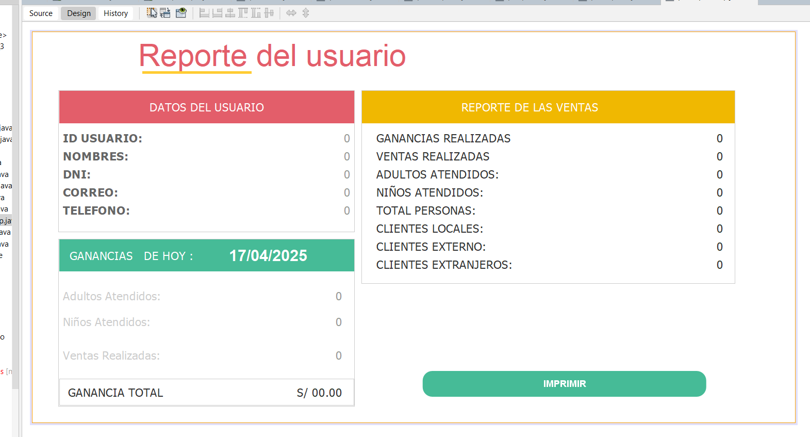
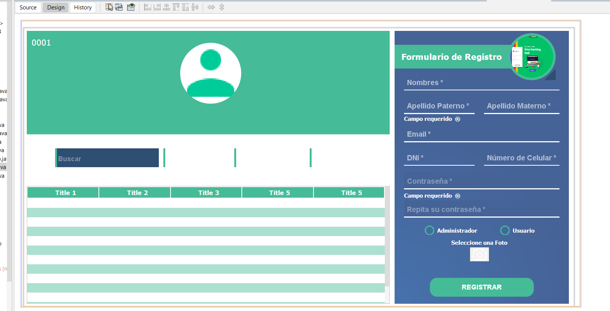
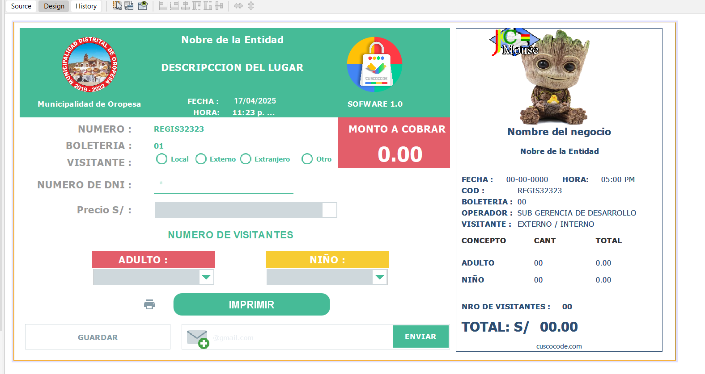

# Sistema para el Humedal Huasao de Oropesa, Cusco

Este proyecto es un sistema **desarrollado en Java y NetBeans** para el **Humedal Huasao** de Oropesa, Cusco. Fue creado con la finalidad de gestionar diversas operaciones relacionadas con el humedal. Este es un sistema de **versión antigua**, pero ha sido fundamental para el funcionamiento en sus primeros años.

Hoy en día, el humedal cuenta con una **versión web** más moderna, la cual también fue desarrollada por nosotros.

## 🖼️ Capturas

A continuación, se presentan algunas capturas del sistema:

1. **Pantalla de inicio del sistema**  
   

2. **Vista de operaciones de gestión**  
   

3. **Pantalla de informes de medición**  
   

4. **Interfaz de configuración del sistema**  
   

5. **Vista detallada de la gestión de recursos**  
   

6. **Pantalla de administración de usuarios**  
   

7. **Interfaz de control de inventarios**  
   

8. **Visualización de gráficos y estadísticas**  
   

9. **Pantalla de seguimiento de eventos**  
   

10. **Módulo de reportes personalizados**  
    

11. **Pantalla de salida y cierre de sesión**  
    

## 🚀 Requisitos

- **JDK (Java Development Kit)** 8 o superior.
- **NetBeans IDE** para ejecutar el proyecto.
